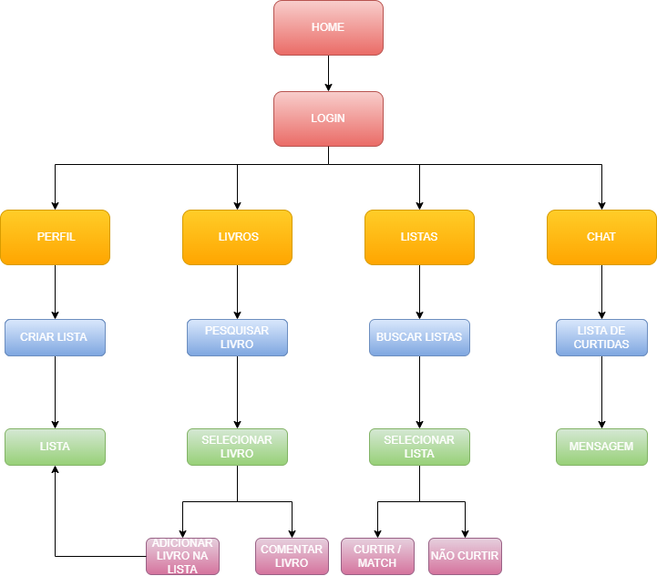

# Projeto de Interface

A montagem da interface do sistema foi cuidadosamente desenvolvida para proporcionar maior conforto ao usuário, para isso estamos estabelecendo foco em acessibilidade, usabilidade e agilidade, todas as telas são projetadas para diferentes tamanhos de tela. Desta forma, o projeto tem uma identidade visual padronizada em todas as telas que são projetadas para funcionamento em desktops e dispositivos móveis.

## Diagrama de Fluxo

O diagrama apresenta o estudo do fluxo de interação do usuário com o sistema. Isso permite que o design das interações e fluxos de tela sejam bem planejados e gerem impacto na qualidade do design do wireframe interativo desenvolvido.

Abaixo o diagrama de fluxo com o caminho a ser percorrido pelo usuário final do site.

## Wireframes

No link abaixo, estão as wireframes desenvolvidas, elas apresentam elementos fundamentais do layout e servirão como modelo para estruturar a interface da apicação. As telas desenvolvidas também são interativas e ilustram o relacionamentos entre páginas e os possíveis caminhos seguidos pelos usuários ao utilizar o site.

> [Wireframes interativas](https://www.canva.com/design/DAE9CQa3vK8/uLpBUynwvJUMHVzxRdLJgg/view?mode=prototype)

