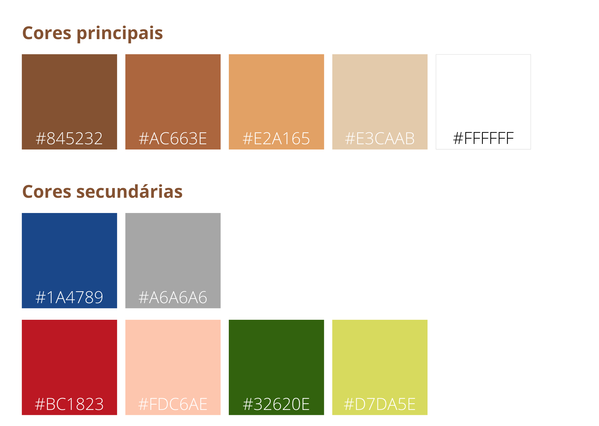
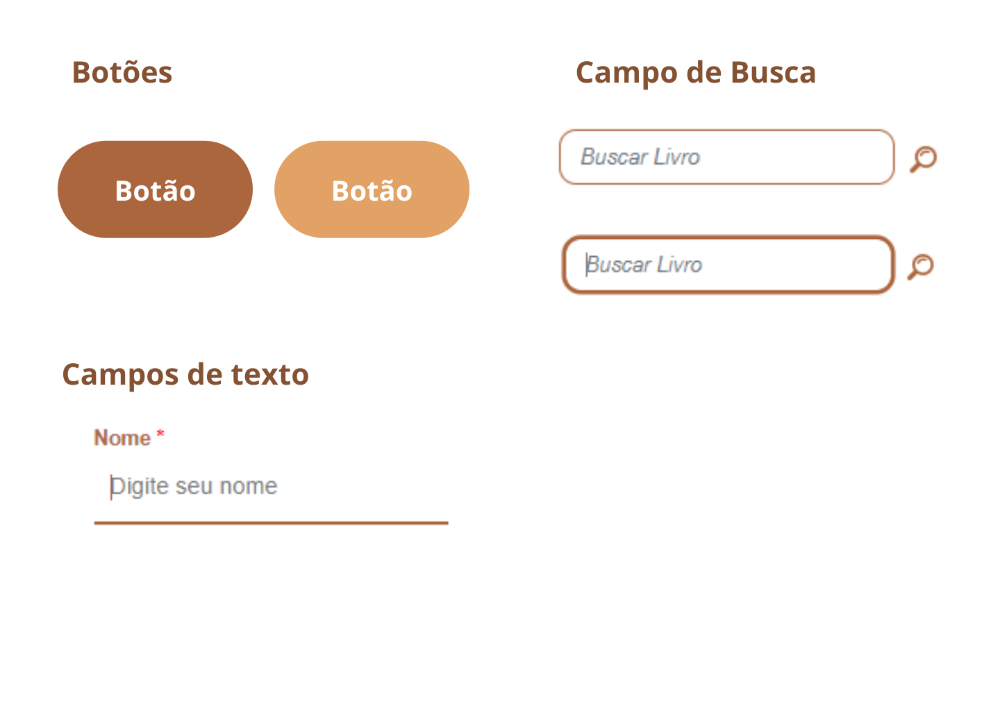
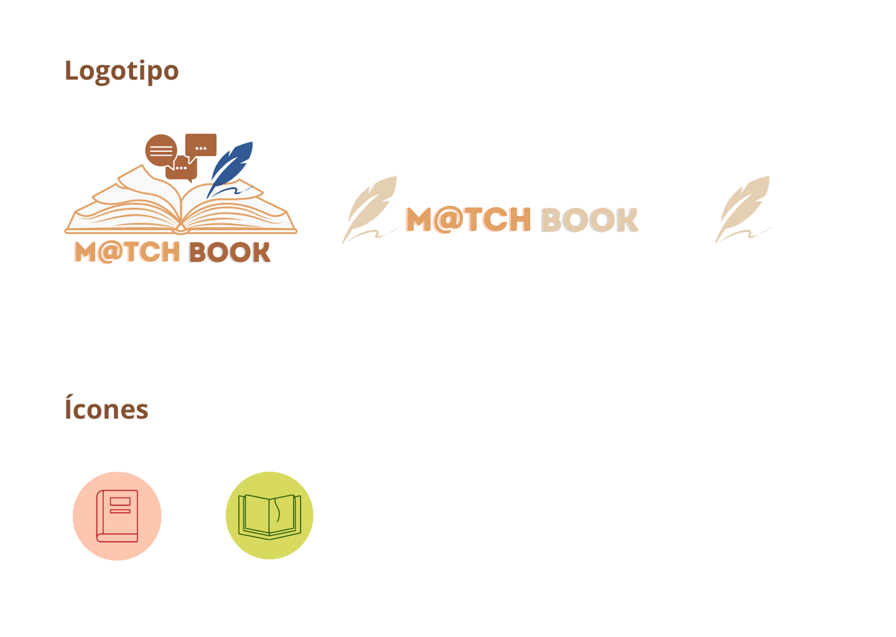
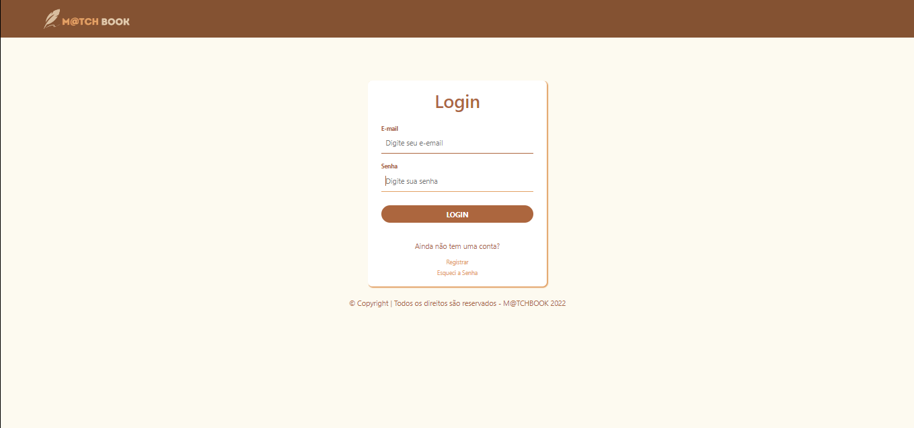
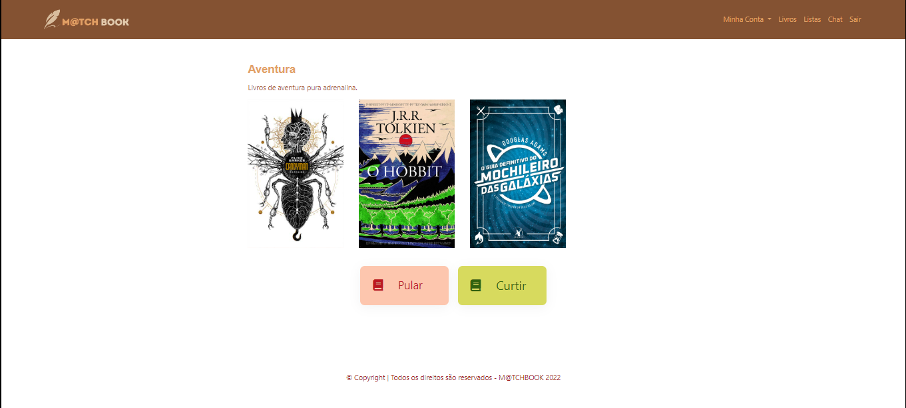
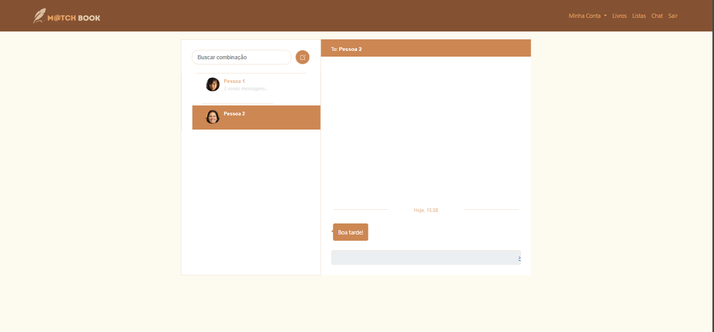
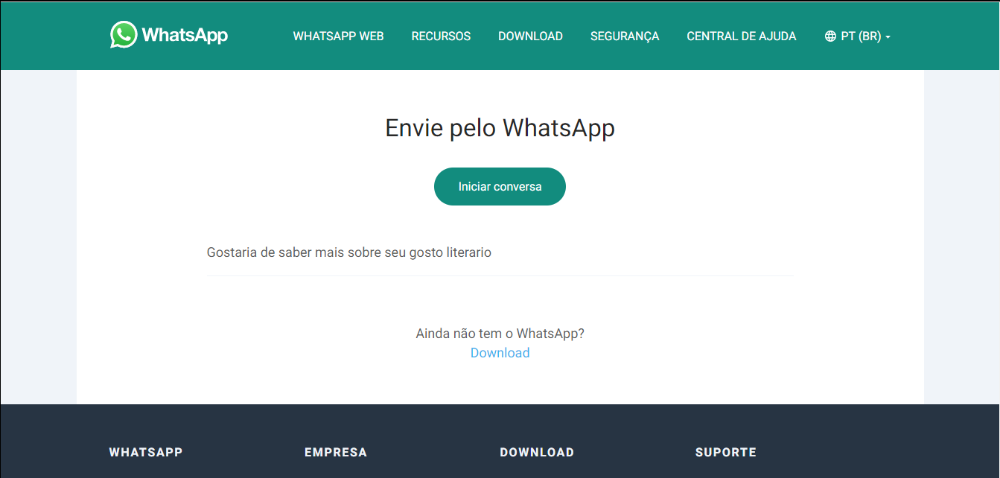

# Template Padrão da Aplicação

Pré-requisitos: <a href="2-Especificação do Projeto.md"> Especificação do Projeto</a>, <a href="3-Projeto de Interface.md"> Projeto de Interface</a>, <a href="4-Metodologia.md"> Metodologia</a>

Layout padrão da aplicação que será utilizado em todas as páginas com a definição de identidade visual, aspectos de responsividade e iconografia.

## Guia de Estilos
Antes de estabelecer o template da aplicação, foi desenvolvido um guia de estilos, detalhado nos itens a seguir, que norteou os padrões de design da interface da aplicação. 

### Paleta de Cores
 

As cores análogas em tons terrosos foram escolhidas para representar todo o charme evidenciado pelas estantes e bibliotecas rústicas, tão recorrentes no universo aconchegante da leitura.

O azul, o cinza e o branco são cores escolhidas para representar a inserção do aconchego da leitura no mundo da tecnologia. O azul, em destaque, representa, também, a inovação, algo que buscamos com o M@tchbook. 

Não em vão, essa intenção é vista na combinação das nossas cores, uma vez que os tons terrosos e o azul são cores complementares e, em sequência, o verde e o vermelho são cores meio-complementares.

Por fim, para harmonizar  a nossa aplicação, escolhemos dois pares análogos: (i) vermelho e rosa salmão e (ii) verde e amarelo. Esses pares, somados às outras cores, contribuem para a sensação de tranquilidade vivida em uma biblioteca.

### Tipografia

As fontes escolhidas para a construção da interface foram a Helvetica e Arial, da família sans-serif, que promovem uma sensação de precisão, clareza e objetividade com seus ângulos mais retos.

### Componentes
 

Os componentes padrão da aplicação enfatizam as cores usadas.

### Ícones

O logotipo foi desenvolvido ao combinar elementos da literatura, como um livro e uma pena usada para escrever, com alguns detalhes do escopo da tecnologia, como o caractere @. Foi feita também uma pequena variação do logo, para que em determinados contextos ele possa ser resumido e melhor posicionado sem afetar a identidade visual da marca.

Os ícones utilizados na avaliação de listas são um livro vermelho que simboliza a negação e um livro verde que simboliza o interesse e curiosidade.

## Fluxo de telas

O fuxo de telas mostra a trilha de uso do usuario pela aplicação.

## Aplicação nas telas:

Abaixo estão representadas as principais telas desenvolvidas, em suas versões para telas maiores e menores, e a explicação de suas funcionalidades.

### Página Inicial

Ao acessar a aplicação, o usuário inicialmente visualiza a página de boas-vindas que contém um pequeno texto de saudação e as opções de entrar ou criar conta.

 

### Cadastro 

Para realizar o primeiro acesso na aplicação, o usuário precisa efetuar o cadastro com seus dados pessoais.

 

### Políticas de Privacidade 

Para acessar o site é preciso concordar com as políticas determinadas.

 

### Login

Na tela login é possivel acessar a aplicação com um email pré-cadastrado.

 

### Estante Livros

Após a confirmação das credenciais, o usuário é direcionado até a página de livros disponíveis, onde pode visualizar as capas dos livros disponiveis, ver detalhes sobre eles e buscar pelos de sua preferência.

 

### Detalhes do livro

Ao clicar em alguma das capas, o usuário poderá ler mais detalhes e informações sobre o livro e adicionar a uma lista de favoritos que poderá ser usada para a criação de uma nova lista. 

 

### Minha Conta

Nessa aba, o usuario pode alterar as informações presentes na aplicação que são referentes a ele.

#### Gerenciar Perfil

Aqui, é possível alterar os dados pessoais.

 

 

#### Gerenciar Listas

Aqui, é possível visualizar e editar as listas literárias criadas previamente, ou criar novas.

 

#### Criar Listas

Aqui, é possível criar listas com nome e descrição.

 

### Listas 

Na página de listas, é possível visualizar as listas de outros usuários, podendo pular para visualizar uma nova lista, ou curtir caso queira conversar com o dono da lista.

 

### Chat

Aqui os usuários que possuem gostos literários compatíveis podem interagir entre si por meio de uma api whatsapp.

  
