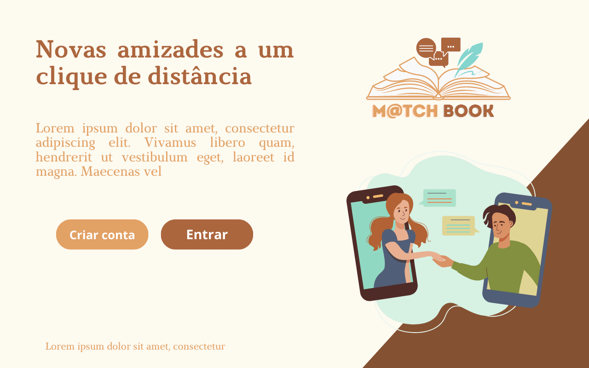
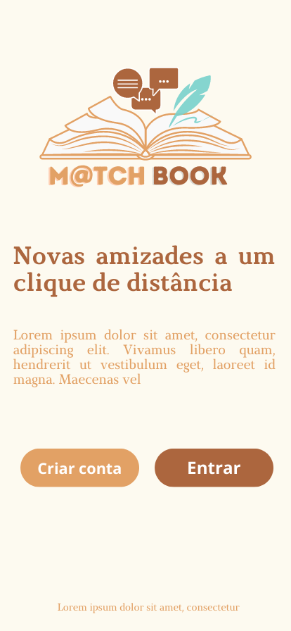
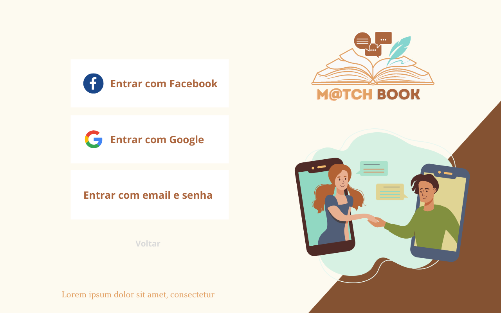
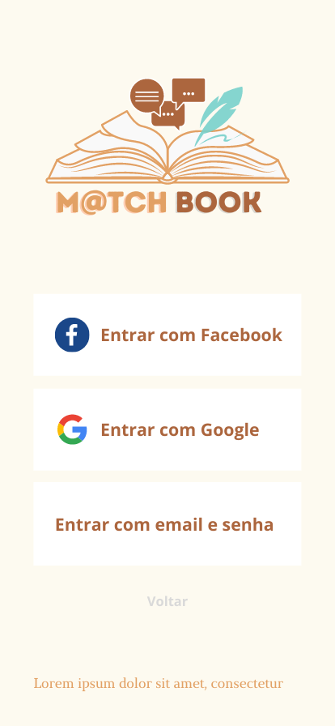
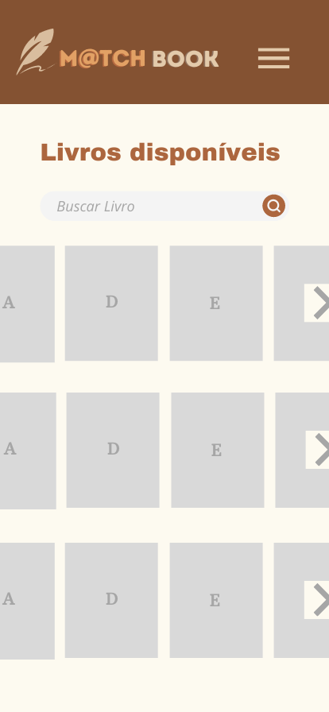
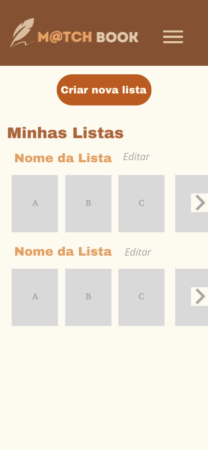
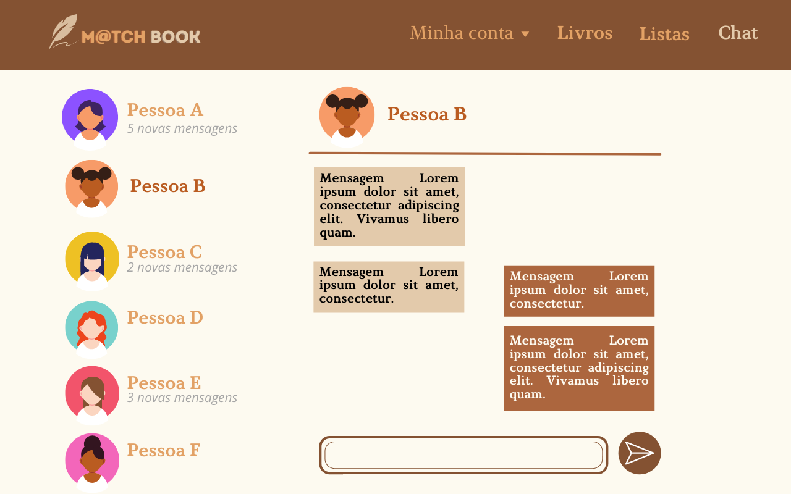
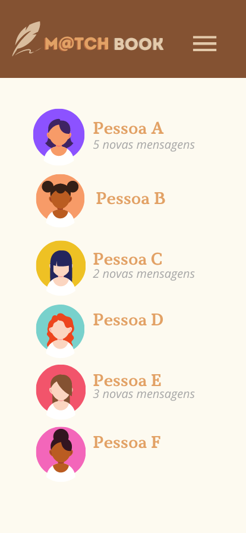

# Template Padrão da Aplicação

Pré-requisitos: <a href="2-Especificação do Projeto.md"> Especificação do Projeto</a>, <a href="3-Projeto de Interface.md"> Projeto de Interface</a>, <a href="4-Metodologia.md"> Metodologia</a>

Layout padrão da aplicação que será utilizado em todas as páginas com a definição de identidade visual, aspectos de responsividade e iconografia.

## Guia de Estilos
Antes de estabelecer o template da aplicação, foi desenvolvido um guia de estilos, detalhado nos itens a seguir, que norteou os padrões de design da interface da aplicação. 

### Paleta de Cores

### Tipografia
Fontes

### Componentes
botões e inputs

### Ícones
curtir, descurtir, logo e etc

## Aplicação nas telas e fluxos:

Abaixo estão representadas as principais telas desenvolvidas, em suas versões para telas maiores e menores, e a explicação de suas funcionalidades.

### Página Inicial

Ao acessar a aplicação, o usuário inicialmente visualiza a página de boas-vindas que contém um pequeno texto de saudação e as opções de entrar ou criar conta.

 

### Entrar

Na tela entrar, estão as opções de login via google, facebook, ou email pré-cadastrado.

 

### Livros disponíveis

Após a confirmação das credenciais, o usuário é direcionado até a página de livros disponíveis, onde pode visualizar as capas dos livros disponiveis e buscar pelos de sua preferência.

 

### Detalhes do livro

Ao clicar em alguma das capas, o usuário poderá ler mais detalhes e informações sobre o livro, comentar, ler comentários de outros leitores e adicionar algum título a uma lista pessoal pré existente. 

 

### Menu de navegação

O usuário pode navegar pelo site por meio de um menu com opções.

 

### Minha Conta

Nessa aba, o usuario pode alterar as informações presentes na aplicação que são referentes a ele.

#### Gerenciar Perfil

Aqui, é possível alterar os dados pessoais.

 

#### Gerenciar Listas

Aqui, é possível visualizar e editar as listas literárias criadas previamente, ou criar novas.

 

#### Criar/Editar Listas

Aqui, é possível fazer alterações nas listas.

 

### Listas 

Na página de listas, é possível visualizar as listas de outros usuários, podendo não curtir (clicando no livro vermelho) e visualizar uma nova lista, ou curtir (clicando no verde). Caso o dono da lista curtida, também curta uma lista sua, o chat entre os usuários ficará disponível.

 

### Chat

Aqui os usuários que possuem gostos literários compatíveis podem interagir entre si.

  
